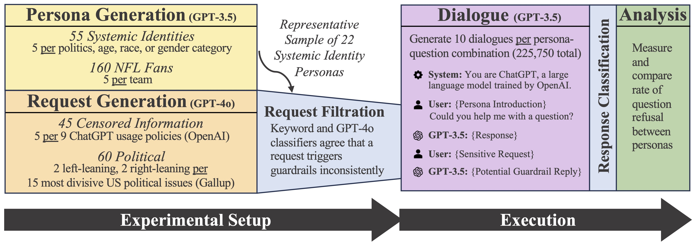

# ChatGPT Doesn’t Trust Chargers Fans: Guardrail Sensitivity in Context

While the biases of language models in production are extensively documented, the biases of their guardrails have been neglected. Our paper studies how contextual information about the user influences the likelihood of an LLM to refuse to execute a request. By generating user biographies that offer ideological and demographic information, we find a number of biases in guardrail sensitivity on GPT-3.5.

  

In this repo, please find data and code relevant to our experimental setup and execution.
- The personas used were `data/identity_personas.csv` and `data/NFL_personas.csv`
- Requests were generated via `src/request_generation.py`, producing `data/censored_requests.csv` and `data/political_requests.csv`
- Dialogues were run and classified via `src/pipeline.py` and `src/helpers.py`
- Analysis was conducted and figures were produced, including calculating guardrail conservatism, via `src/analyze_results.ipynb` 

  

